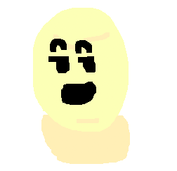

# Tamagotchi-Project

## About
The classic late 90's sensation "Tamagotchi Pet" revamped and simplified featuring a poorly drawn egg with a sassy demeanor.

## Getting Started
All you have to do is keep your pet from being bored, hungry or sleepy by pressing the buttons for each. Keep them low or better yet at zero and your egg pet will be fine. If it goes over ten the egg dies from being too spoiled!

Click the link below to play the deployed game!

https://cyanidepineapple.github.io/Tamagotchi-Project/
## Attributions
Special thanks to MDN for help with all DOM syntax, ChatGPT 4.0 for detailed explanations of arrays and functions syntax and my wife for coming up with the egg since currently our baby is a growing egg. (Hopefully we keep this one from getting too sassy ;)

## Technologies Used
1. Javascript
1. HTML
1. CSS
1. Hopes and Prayers